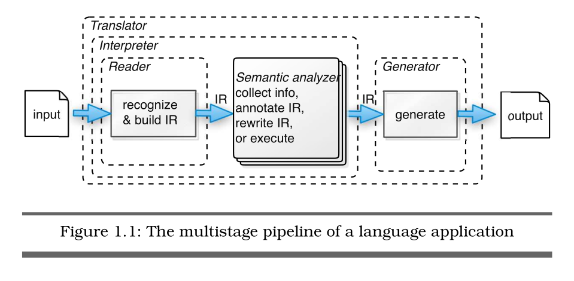
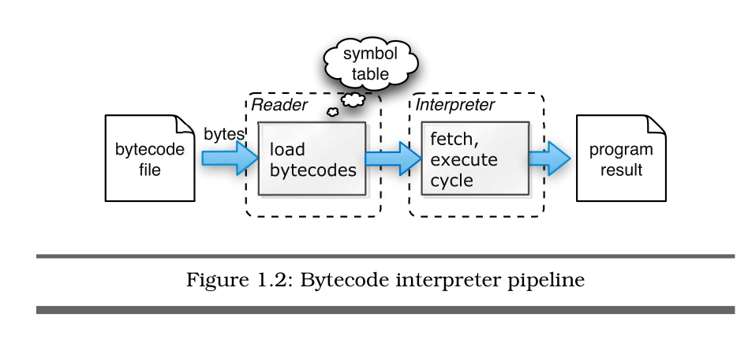
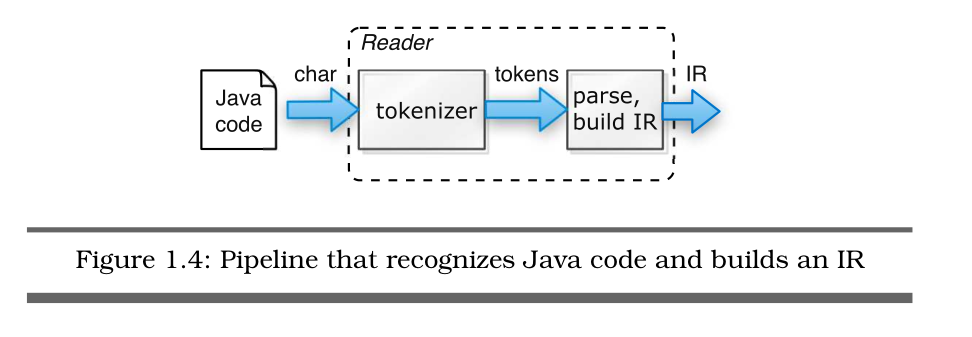
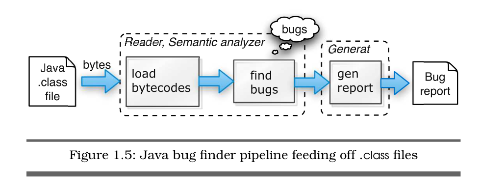
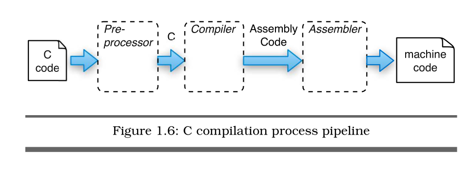
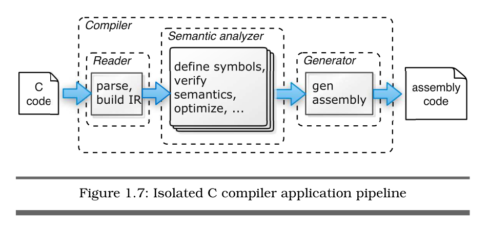

# Language Implementation patterns
  Create Your Own Domain-Specific and General Programming Languages

## Preface

## Getting Started with Paresing

### Language Applications Cracked Open 

四个阶段：

* Rader：从输入流构建数据结构，输入流通常是文件而非二进制数据。
* Generator：  A generator walks an internal data structure and emits output. Examples include object-to-relational database mapping tools, object serializers, source code generators, and web page generators.
* Translator or Rewriter: 读取文本或二进制输入，输出相等的其它语言。
* Interpreter: 读取，解码，和执行指令。

Bytecode Interpreter

Source-level Bug Finder

Java Bug Finder

Java Bug Finder Part Deux

C compilation process 

C compiler application

C++ (cfront) compilation process

 compilation process pipeline.png)

### Basic Parsing Patterns 
    - 模式1 映射语法到递归下降解析，这个模式告诉我们怎么转换语法到手工解析树，它被用于下面三个模式。
    - 模式2 LL(1)递归下降词法分析器，这个模式把字符流转换成通过解析器定义的之后的模式的单词。
    - 模式3 LL(1)递归下降解析器，这是最广为人知的递归下降解析模式。它仅仅看当前输入字符来决定解析选择。对于每个一个语法规则，对应在解析器中有一个解析方法。
    - 模式4 LL(k)递归下降解析器，它比LL(1)能多超前看字符来做决定。
    - 模式5 回溯解析器
    - 模式6 Memoizing Parser
    - 模式7 Predicated Parser
    - 
### Enhanced Parsing Patterns
## Analyzing Languages
### Building Intermediate Form Trees
### Walking and Rewriting Trees
### Tracking and Identifying Program Symbols
### Managing Symbol Tables for Data Aggregate
### Enforcing Static Typing Rules
## Building Interpreters
### Building High-level Interpreters
### Building Bytecode Interpreters
## Translating and Geneating Language
### Translating Compuer Languages
### Generating DSLs with Templates
### Puttinig It All Together
